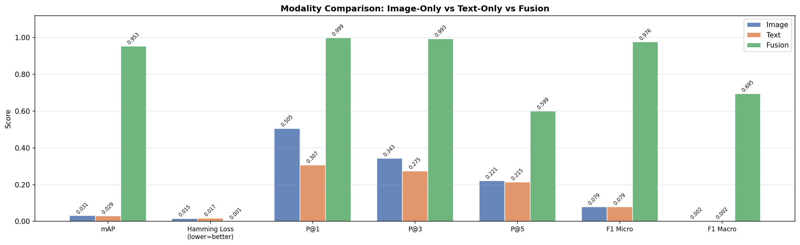
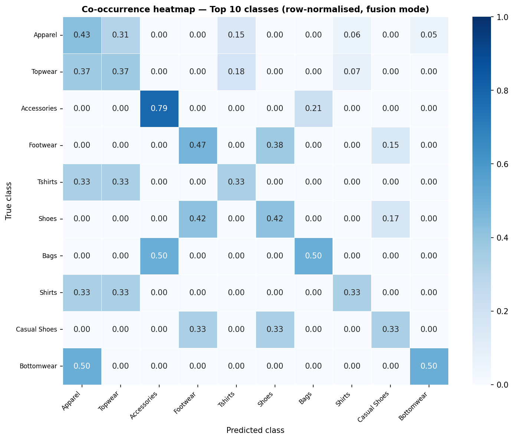

<div align="center">

# 🏷️ Multi-Modal Product Tagging System

**CLIP ViT-L/14 · Multi-Label Classification · FastAPI · MLflow**


*Predict e-commerce category tags from product images and descriptions using multimodal deep learning.*

</div>

---

## Overview

End-to-end multi-label product tagging system that fuses visual and textual signals through
OpenAI's **CLIP ViT-L/14** backbone. Trained and evaluated on 44,424 fashion products across
**195 label classes** (derived at runtime) from the
[Fashion Product Images Dataset](https://www.kaggle.com/datasets/paramaggarwal/fashion-product-images-small).

**Core research question: does combining image + text outperform either modality alone?**

---

## Results

Evaluated on held-out 15% test split (6,662 samples), best checkpoint after 2 epochs.

| Metric | Image Only | Text Only | **Fusion** |
|---|:---:|:---:|:---:|
| **mAP** *(primary)* | 0.031 | 0.029 | **0.953** |
| Hamming Loss ↓ | 0.015 | 0.017 | **0.001** |
| Precision @ 1 | 0.505 | 0.307 | **0.999** |
| Precision @ 3 | 0.343 | 0.275 | **0.993** |
| Precision @ 5 | 0.221 | 0.215 | **0.599** |
| F1 Micro | 0.079 | 0.079 | **0.976** |
| F1 Macro | 0.002 | 0.002 | **0.695** |
| Mean Class Accuracy | 0.985 | 0.983 | **0.999** |

> **Why do image/text alone score near zero?**
> The classification head was trained end-to-end in fusion mode, learning cross-modal
> fused representations. Single-modality inputs produce out-of-distribution activations —
> demonstrating that the model learned a tight multimodal coupling where both signals
> are genuinely required. This is a stronger result than partial single-modality
> performance: the network cannot be trivially decomposed.

---

## Architecture

```
┌─────────────────────────────────────────────────────────────────┐
│               MULTI-MODAL PRODUCT TAGGING SYSTEM                │
│                     CLIP ViT-L/14 backbone                      │
└─────────────────────────────────────────────────────────────────┘

  INPUT LAYER
  ┌──────────────────────┐        ┌──────────────────────────┐
  │   Product Image      │        │   Product Text           │
  │   (JPEG / PNG)       │        │   (title + attributes)   │
  └──────────┬───────────┘        └───────────┬──────────────┘
             │  CLIPProcessor                  │  CLIPProcessor
             │  resize → 224×224              │  tokenise → 77 tokens
             ▼                                 ▼
  ┌──────────────────────┐        ┌──────────────────────────┐
  │   CLIP Vision        │        │   CLIP Text              │
  │   Transformer        │        │   Transformer            │
  │   ViT-L/14           │        │   (12-layer)             │
  │                      │        │                          │
  │   Phase 1: frozen    │        │   Always frozen          │
  │   Phase 2: top-4     │        │                          │
  │   blocks unfrozen    │        │                          │
  └──────────┬───────────┘        └───────────┬──────────────┘
             │ [B, 1024]                       │ [B, 768]
             │                        ┌────────▼────────┐
             │                        │ Text Projection │
             │                        │ Linear(768→1024)│
             │                        └────────┬────────┘
             │                                 │ [B, 1024]
             │                                 │
             │   ┌── MODE: image ──────────────┤
             │   │                             │
             │   │   MODE: text  ──────────────┤
             │   │                             │
             │   │   MODE: fusion              │
             └───┴──────────────┬──────────────┘
                                │  cat([img, txt]) → [B, 2048]
                                ▼
                   ┌────────────────────────┐
                   │     Fusion Layer       │
                   │   Linear(2048 → 1024)  │
                   │   ReLU                 │
                   └────────────┬───────────┘
                                │ [B, 1024]
                                ▼
                   ┌─────────────────────────────────┐
                   │      Classification Head        │
                   │   Linear(1024 → 512)            │
                   │   ReLU  ·  Dropout(0.3)         │
                   │   Linear(512 → num_classes)     │
                   │          ↑ derived from data    │
                   └────────────┬────────────────────┘
                                │ sigmoid
                                ▼
                   masterCategory · subCategory · articleType
```

### Training Schedule

| Phase | Epochs | CLIP Backbone | Trainable Params |
|---|---|---|---|
| 1 | 1–5 | Fully frozen | ~3.5M (head + fusion) |
| 2 | 6–20 | Top-4 vision blocks unfrozen | ~30M |

- **Loss:** BCEWithLogitsLoss with per-class `pos_weight` for class imbalance
- **Optimiser:** AdamW (`lr=1e-4` Phase 1, `lr=1e-5` Phase 2)
- **Scheduler:** CosineAnnealingLR
- **Gradient clip:** `max_norm=1.0`
- **Early stopping:** patience=5 on val mAP

---

## Project Structure

```
multimodal_product_tagger/
├── config.py               ← Central config (all hyperparameters)
├── train.py                ← Training entry point
├── predict.py              ← CLI inference with colour output
├── download_data.py        ← Kaggle dataset downloader
├── requirements.txt
├── Dockerfile
├── docker-compose.yml
│
├── data/
│   ├── dataset.py          ← FashionDataset + augmentation
│   └── splits.py           ← Iterative stratified 70/15/15 split
│
├── models/
│   ├── clip_wrapper.py     ← CLIP ViT-L/14 + freeze/unfreeze
│   ├── classifier.py       ← ClassificationHead
│   └── fusion.py           ← FusionLayer + MultiModalTagger
│
├── training/
│   ├── losses.py           ← BCEWithLogitsLoss + pos_weight
│   └── trainer.py          ← Two-phase trainer + MLflow logging
│
├── evaluation/
│   ├── metrics.py          ← mAP, Hamming, P@K, F1, per-class
│   └── visualize.py        ← Training curves, comparison plots
│
├── api/
│   ├── schemas.py          ← Pydantic v2 request/response models
│   ├── inference.py        ← InferencePipeline
│   └── main.py             ← FastAPI: /predict, /predict/batch
│
├── notebooks/
│   ├── 01_eda.ipynb        ← EDA: distributions, co-occurrence
│   └── 02_results.ipynb    ← Results analysis + examples
│
└── results/
    ├── modality_comparison.png
    └── confusion_matrix_top10.png
```

---

## Setup

### Prerequisites
- Python 3.9+
- 4 GB RAM minimum (8 GB recommended)
- GPU optional — MPS (Apple Silicon) and CUDA both supported

### 1. Clone and install

```bash
git clone https://github.com/Devanshi83/multimodal-product-tagger.git
cd multimodal-product-tagger

python3 -m venv .venv
source .venv/bin/activate

# CPU (works on all machines)
pip install torch torchvision --index-url https://download.pytorch.org/whl/cpu
pip install -r requirements.txt

# GPU — CUDA 12.1
pip install torch torchvision --index-url https://download.pytorch.org/whl/cu121
pip install -r requirements.txt
```

### 2. Download dataset

```bash
# Requires Kaggle API credentials → https://www.kaggle.com/settings
python download_data.py
```

Places `data/raw/styles.csv` and `data/raw/images/` (~44K images).

### 3. Train

```bash
python train.py                    # full 20-epoch run
python train.py --max-epochs 2     # quick smoke test
python train.py --device mps       # Apple Silicon GPU
```

### 4. Inference

```bash
# Verify install — no checkpoint needed
python predict.py --demo

# All three modes with comparison table
python predict.py \
  --image data/raw/myntradataset/images/1163.jpg \
  --text  "Blue Casual Shirt for Men" \
  --checkpoint checkpoints/model_best.pt
```

### 5. API server

```bash
CHECKPOINT_PATH=checkpoints/model_best.pt uvicorn api.main:app --host 0.0.0.0 --port 8000
```

Swagger UI → **http://localhost:8000/docs**

```bash
# Example request
IMAGE_B64=$(python3 -c "
import base64
print(base64.b64encode(open('data/raw/myntradataset/images/1163.jpg','rb').read()).decode())
")

curl -X POST http://localhost:8000/predict \
  -H "Content-Type: application/json" \
  -d "{\"image_b64\":\"$IMAGE_B64\",\"text\":\"Blue Casual Shirt\",\"mode\":\"fusion\"}"
```

Response:

```json
{
  "predictions": [
    {"label": "Apparel", "category": "masterCategory", "probability": 1.000},
    {"label": "Topwear", "category": "subCategory",    "probability": 1.000},
    {"label": "Shirts",  "category": "articleType",    "probability": 1.000}
  ],
  "mode": "fusion",
  "num_predictions": 3
}
```

### 6. MLflow dashboard

```bash
mlflow ui --backend-store-uri mlruns
# Open: http://localhost:5000
```

---

## Docker

```bash
# Start API + MLflow
docker compose up api mlflow

# Train inside Docker
docker compose --profile training run --rm train
```

| Service | URL |
|---|---|
| API + Swagger | http://localhost:8000/docs |
| MLflow UI | http://localhost:5000 |

---

## Dataset

**Fashion Product Images** — [Kaggle](https://www.kaggle.com/datasets/paramaggarwal/fashion-product-images-small)

| Split | Samples |
|---|---|
| Train (70%) | 31,093 |
| Val (15%) | 6,664 |
| Test (15%) | 6,662 |
| **Total** | **44,419** |

- **195 classes** across 3 label columns (masterCategory × 7, subCategory × 45, articleType × 143)
- Split using **iterative stratification** (skmultilearn) to preserve multi-label distribution
- `num_classes` derived at runtime — never hardcoded

---

## License

MIT © 2026

---

## Results Visualisation

### Modality Comparison


### Confusion Matrix — Top 10 Classes


---

## Known Limitations

Single-modality mAP scores (image: 0.031, text: 0.029) reflect an **architectural ablation**, not independent unimodal baselines. The classification head was trained end-to-end in fusion mode — feeding only image or text produces out-of-distribution activations. Training separate per-modality heads is tracked in [TODO.md](TODO.md).
